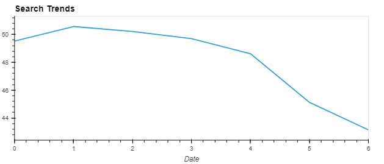

# Homework_week_11
***
## The financial analysis below is undertaken to process google search traffic alongside stock price of a popular Latin American stock "Mercado" for purpose of analysis and correlation. I have also used Facebook's Prophet as the prediction function to forecast search trends for 2000 hours. I was successfully able to answer the following questions.
#

## 1. Question: Did the Google search traffic increase during the month that MercadoLibre released its financial results?
##
### Bar plot overlay of May 2020 search trends against the overall monthly median.

## Answer: Yes. It increased by approximately 300 more searches.
#
## 2. Question: Does any day-of-week effect that you observe concentrate in just a few hours of that day?
##
### Line plot of the Day of Week Search Trend.

### Heatmap of the Search Trend Hourly vs Day of Week.

## Answer: Yes, the heatmap correlation indicates that the last day of the week (Sunday) seems to have the least concentration of search trends hours among the remaining days of the week. The concentration of search trend hours for the remaining days, with Tuesday through to Friday showing the heaviest, is mostly high around midnight hours. Consequently, the time format here maybe reflecting to a different timezone required adjustment.
#
## 3. Question: Does the search traffic tend to increase during the winter holiday period (weeks 40 through 52)?
##
### Line plot of the Week of Year Search Trend.

## Answer: Yes, it the search traffic seems to decline during early holiday periods, but it is quick to pick up back to the average trend midway through the holiday season.
#
## 4. Question: Do both time series indicate a common trend that’s consistent with this narrative?
##
### First Half of 2020 Mercado Stock and Search Trend plots.

## Answer: The mercado stock saw a steep increase in closing price which initiated in 2020, while the seach traffic for that period seems fairly consistent. However, at 2020-05-05 around 16:00 the stock price exhibited an unprecedented sudden increase of more than 20% in just one hour. This was preceeded by the periodic growth in search traffic, but did in fact align at 17:00 with the search traffic hitting an all time high of that 6 months period. Nonethelss, the stock price continued to rise while search trends fluctuated with their regular cycles.
#
## 5. Question: Does a predictable relationship exist between the lagged search traffic and the stock volatility or between the lagged search traffic and the stock price returns?
##
### Correlation Table of Stock Volatility, Lagged Search Trends, and Hourly Stock Return.

## Answer: The correlation is higher for the relationship between the lagged search traffic and the stock volatility, however it is inversely proportional in oppose to the relationship with the hourly stock return.
#
## 6. Question: How's the near-term forecast for the popularity of MercadoLibre?
##
### Prophet Forecast Plot.

## Answer: The prediction shows that popularity trend will trend downwards.
#
## 7. Questions: 
## What time of day exhibits the greatest popularity?
## Which day of week gets the most search traffic? 
## What's the lowest point for search traffic in the calendar year?
##
### Prophet Forecast Component Plots.

## Answers:
## Midnight.
## Tuesday.
## Mid-October seems to have the lowest point for search traffic in the calendar year.
##
****